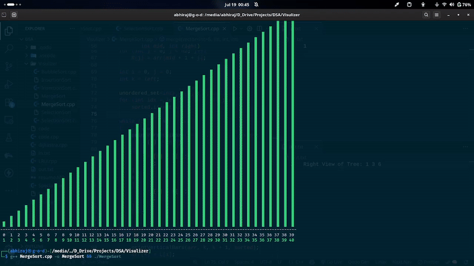

# 🎯 Sorting Techniques Visualizer

A comprehensive collection of sorting algorithm implementations with interactive visual demonstrations. Each algorithm includes step-by-step visualization to help understand how different sorting techniques work internally.

## 📚 Table of Contents

-   [Overview](#overview)
-   [Algorithms Implemented](#algorithms-implemented)
-   [Features](#features)
-   [How to Use](#how-to-use)
-   [Algorithm Details](#algorithm-details)
-   [Compilation & Execution](#compilation--execution)
-   [Visual Elements](#visual-elements)
-   [Performance Comparison](#performance-comparison)
-   [Contributing](#contributing)

## 🔍 Overview

This project contains **20 different sorting algorithms** implemented in C++ with real-time visualization capabilities. Each implementation demonstrates the algorithm's behavior through colored bar charts, making it easier to understand the sorting process.

### 🎬 Example Visualization

Here's how the Merge Sort algorithm looks in action:



_Watch as the algorithm divides the array into smaller parts and then merges them back in sorted order!_

## 🚀 Algorithms Implemented

### **Basic Sorting Algorithms**

-   **BubbleSort.cpp** - Simple comparison-based algorithm
-   **SelectionSort.cpp** - Finds minimum and places it at beginning
-   **InsertionSort.cpp** - Builds sorted array one element at a time

### **Efficient Sorting Algorithms**

-   **MergeSort.cpp** - Divide and conquer approach
-   **QuickSort.cpp** - Partition-based sorting
-   **HeapSort.cpp** - Uses binary heap data structure

### **Specialized Sorting Algorithms**

-   **CountSort.cpp** - Non-comparison integer sorting
-   **RadixSort.cpp** - Digit-by-digit sorting
-   **BucketSort.cpp** - Distributes elements into buckets

### **Hybrid & Advanced Algorithms**

-   **TimSort.cpp** - Python's default sorting algorithm
-   **ShellSort.cpp** - Generalization of insertion sort
-   **CombSort.cpp** - Improvement over bubble sort

### **Unique & Specialized Algorithms**

-   **BitonicSort.cpp** - Parallel sorting network
-   **PatienceSort.cpp** - Based on patience card game
-   **CocktailSort.cpp** - Bidirectional bubble sort
-   **GnomeSort.cpp** - Similar to insertion sort
-   **CycleSort.cpp** - Minimizes memory writes
-   **Odd-Even-Sort.cpp** - Parallel sorting algorithm
-   **PigeonholeSort.cpp** - Suitable for small range of keys
-   **BogoSort.cpp** - Highly inefficient random sort (for educational purposes)

## ✨ Features

-   **Real-time Visualization**: Watch algorithms sort data step by step
-   **Color-coded Elements**:
    -   🔴 **Red**: Currently being processed
    -   🔵 **Blue**: Unsorted elements
    -   🟢 **Green**: Sorted/final position
-   **Step Counter**: Track the number of operations
-   **Cross-platform**: Works on Windows, Linux, and macOS
-   **Educational**: Perfect for learning algorithm behavior

## 🎮 How to Use

### Prerequisites

-   C++ compiler (GCC, Clang, or MSVC)
-   Terminal/Command prompt
-   C++17 or later support

### Running a Sorting Algorithm

1. **Navigate to the directory**:

    ```bash
    cd "Sorting Techniques Visulizer"
    ```

2. **Compile any algorithm**:

    ```bash
    g++ -o BubbleSort BubbleSort.cpp -std=c++17
    ```

3. **Run the visualization**:

    ```bash
    ./BubbleSort
    ```

4. **Watch the magic happen!** 🎪

## 📊 Algorithm Details

| Algorithm      | Time Complexity | Space Complexity | Stability | In-Place |
| -------------- | --------------- | ---------------- | --------- | -------- |
| Bubble Sort    | O(n²)           | O(1)             | ✅        | ✅       |
| Selection Sort | O(n²)           | O(1)             | ❌        | ✅       |
| Insertion Sort | O(n²)           | O(1)             | ✅        | ✅       |
| Merge Sort     | O(n log n)      | O(n)             | ✅        | ❌       |
| Quick Sort     | O(n log n) avg  | O(log n)         | ❌        | ✅       |
| Heap Sort      | O(n log n)      | O(1)             | ❌        | ✅       |
| Count Sort     | O(n + k)        | O(k)             | ✅        | ❌       |
| Radix Sort     | O(d × n)        | O(n + k)         | ✅        | ❌       |
| Tim Sort       | O(n log n)      | O(n)             | ✅        | ❌       |
| Shell Sort     | O(n log²n)      | O(1)             | ❌        | ✅       |

## 🛠 Compilation & Execution

### Single Algorithm

```bash
# Compile
g++ -o <algorithm_name> <algorithm_name>.cpp -std=c++17

# Run
./<algorithm_name>
```

### Batch Compilation (All Algorithms)

```bash
# Create a script to compile all
for file in *.cpp; do
    name="${file%.cpp}"
    g++ -o "$name" "$file" -std=c++17
    echo "Compiled $name"
done
```

## 🎨 Visual Elements

### Color Scheme

-   **🔵 Blue Bars**: Unsorted elements waiting to be processed
-   **🔴 Red Bars**: Elements currently being compared or moved
-   **🟢 Green Bars**: Elements in their final sorted position
-   **⚪ Gray Elements**: Padding or auxiliary elements (for specific algorithms)

### Display Information

-   **Step Counter**: Shows current operation number
-   **Array Indices**: Numbered positions below bars
-   **Element Values**: Numeric values displayed below the visualization
-   **Algorithm Name**: Displayed in the header

## ⚡ Performance Comparison

### Best Case Scenarios

-   **Insertion Sort**: Already sorted array - O(n)
-   **Bubble Sort**: Already sorted array - O(n)
-   **Quick Sort**: Balanced partitions - O(n log n)

### Worst Case Scenarios

-   **Quick Sort**: Already sorted array - O(n²)
-   **Bogo Sort**: Infinite time (worst possible)
-   **Bubble Sort**: Reverse sorted array - O(n²)

### Recommended Usage

-   **Small datasets (< 50)**: Insertion Sort, Selection Sort
-   **Medium datasets (50-1000)**: Quick Sort, Merge Sort
-   **Large datasets (> 1000)**: Tim Sort, Heap Sort
-   **Integer-only data**: Count Sort, Radix Sort
-   **Educational purposes**: All algorithms!

## 🎓 Educational Value

This collection is perfect for:

-   **Computer Science Students**: Understanding algorithm behavior
-   **Interview Preparation**: Visualizing sorting concepts
-   **Algorithm Analysis**: Comparing different approaches
-   **Teaching**: Demonstrating sorting concepts visually

## 🤝 Contributing

Feel free to contribute by:

1. Adding new sorting algorithms
2. Improving visualizations
3. Optimizing existing implementations
4. Adding performance metrics
5. Creating comparative analysis tools

## 📝 Implementation Notes

-   All algorithms use `vector<int>` for consistency
-   Visualization updates occur after each significant operation
-   Arrays are populated with random unique values
-   Terminal clearing works on both Windows and Unix systems
-   Sleep intervals are adjustable for different viewing speeds

## 🎯 Future Enhancements

-   [ ] Add sound effects for operations
-   [ ] Implement GUI version
-   [ ] Add performance benchmarking
-   [ ] Create algorithm comparison mode
-   [ ] Add custom array input option
-   [ ] Implement step-by-step debugging mode

---

**Happy Sorting!** 🎉

_Created with ❤️ for educational purposes_
